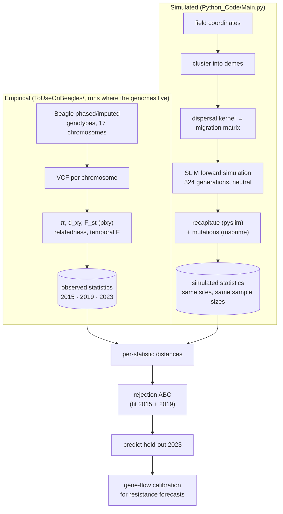

# Spatiotemporal CPB Modeling with SLiM

A calibrated model of how genetic material moves among **Colorado Potato Beetle** (*Leptinotarsa
decemlineata*) populations across the Wisconsin potato landscape, built by fitting a spatially
explicit forward simulation to beetle genomes sampled over eight years.

<p>
  
  
  
  
  
  
</p>

---

## Why

CPB is one of the most damaging pests of potato, and it has evolved resistance to nearly every
insecticide used against it. When a resistance allele appears in one field, whether it spreads
across a region or stays local, and therefore whether resistance elsewhere is more likely to have
spread in or arisen independently, depends on how much beetles move genes between fields from one
year to the next. That movement is hard to observe directly but leaves a record in the genome.

The aim of this project is a model that captures that movement well enough to make forecasts:
given where an allele is now and how strongly it is favoured, how far and how fast should it be
expected to spread?

## The idea

The model is **neutral**: it contains no selection. That is deliberate. The speed at which a
favoured allele spreads through a structured population depends roughly on two things, how far
genes disperse each generation and how strong selection is (wave speed ∝ σ·√(2s)). Neutral genetic
variation carries information about the first and none about the second. So the genomes are used
to calibrate the gene-flow side of the forecast, and the selection coefficient for a given
insecticide is supplied separately.

Two consequences follow from treating the project as forecasting rather than parameter estimation:

- **Not every parameter needs to be pinned down.** Population size and migration rate trade off
  against each other in neutral data, and only their product is well identified. That matters less
  when the question is what the model *predicts*, so the answer to it is a sensitivity analysis
  across the plausible combinations rather than a single best estimate.
- **The model has to be tested on data it has not seen.** It is fitted to the 2015 and 2019
  samples, and the 2023 samples are held out. The model counts as validated only if it predicts
  2023's genetic diversity and differentiation within its stated uncertainty.

## The data

Beetles were collected from Wisconsin potato fields in **2015, 2019 and 2023**, about 2
generations per year, so 8 and 16 generations apart. Most sites are commercial grower fields;
one is a university research station. The set of sites differs each year (24, 17 and 20
populations), and samples per site are small (2–19 individuals). Because potato fields are rotated,
collectors deliberately sampled the field nearest the previous one, so each site tracks a
persistent local population even though the field under it changes.

The genomes were sequenced, phased and imputed with Beagle across 17 chromosomes. For each year the
pipeline computes, for every site and pair of sites:

- **nucleotide diversity (π)**, the genetic variation within a population;
- **d_xy and F_st**, divergence and differentiation between populations;
- **genetic relatedness**;

along with a **temporal** comparison of allele frequencies at the same locations across years.

## The model

The simulation, written in **SLiM**, places the beetles in demes formed by clustering the real field
coordinates. Migration between demes follows a dispersal kernel over the real geographic distances.
The forward simulation runs neutrally for the 324 generations since the Wisconsin and New York
populations split, and at generations 308, 316 and 324 it samples the same sites, and the same number of
individuals per site, as the real collections.

SLiM records the full genealogy as a tree sequence rather than simulating mutations. **pyslim** then
attaches the deeper ancestral history (recapitation), **msprime** places mutations on the
genealogy, and **tskit** computes the same statistics as the empirical side, using the same
estimators and the same population ordering. Where the real data have a known measurement error,
such as a heterozygote deficit in the genotype calls, the simulated samples have it applied as well,
so the two sides are measured the same way.

The model runs at 1/100 of real population scale for tractability, with mutation and recombination
rates scaled up to match. Its mutation and recombination rates are therefore calibration constants,
not biological estimates; only the composite quantity θ = 4Nμ is meaningful.

## Fitting

Parameters are fitted by **rejection Approximate Bayesian Computation (ABC)**: draw parameters from
a prior, simulate, compare the simulated statistics with the observed ones, and keep the draws that
come closest. The free parameters are population size, the total migration rate, the shape of the
dispersal kernel, and the number of demes. Thousands of simulations are run as batches on the
**CHTC** high-throughput cluster at UW–Madison. Each statistic's distance is standardized by its
spread across the batch before the statistics are combined.



## Where it stands

The simulation and empirical pipelines are complete and agree with each other in units, estimators
and sampling design. Several ABC batches have run on CHTC. Across those batches, the model reproduces
the observed levels of diversity and differentiation. The data identify the product of population
size and migration well, but not either one separately. Allele-frequency change between years turns
out to be dominated by genotyping error rather than genetic drift in populations this large, so it
is better suited to checking the model than to fitting it. A cross-year version of F_st, comparing
sites across years by distance and time gap, is being developed to test whether the model's
population structure persists over time the way the real one does. The 2023 hold-out test has not
yet been run.

## Repository layout

| Path | Contents |
|---|---|
| `Python_Code/Main.py` | One simulation end to end: cluster → migration matrix → SLiM → recapitate → statistics |
| `Python_Code/AnalyzeTreeSeq.py` | Tree-sequence processing and the simulated statistics |
| `Python_Code/ABCAnalysisNoRedis.py` | ABC driver: priors, per-statistic distances. The CHTC entrypoint |
| `Python_Code/abc_standardize.py` | Combines a finished batch's distances into one standardized ranking |
| `Python_Code/scale_constants.py` | The model's scale constants (mutation rate, recombination rate, ancestral size) |
| `Python_Code/fc_common.py`, `ld_common.py` | Statistic definitions shared by the simulated and empirical sides |
| `SLiM_Code/CPBSampleSim{Win,Linux}.slim` | The forward simulation (identical apart from path separators) |
| `ToUseOnBeagles/` | Empirical pipeline, run on the machine holding the genomes |
| `diagnostics/` | Analysis and checking scripts, most of which run on existing outputs without simulating |
| `data/` | Field coordinates, site lists, observed statistics, simulation outputs |

## Running it

```bash
conda env create -f environment.yml
conda activate cpb-env
cd Python_Code

# one simulation + statistics (prompts for its parameters)
python Main.py

# one ABC job: <job_id> is a label; results append to ../out/abc_results.csv
python ABCAnalysisNoRedis.py <job_id> <num_trials>
```

Paths inside `Python_Code/` are relative to that directory. **The pipeline overwrites files in
`data/` in place**, so run experiments on a copy of the repository. A single trial takes minutes
locally at small population sizes. Large ones need tens of GB of memory, which is why the batches
run on CHTC.

## References

Cohen, Z. P., Schoville, S. D., et al. (2022). Evidence of hard selective sweeps suggests
independent adaptation to insecticides in Colorado potato beetle (Coleoptera: Chrysomelidae).
*Evolutionary Applications* **15**:1691–1705.
[doi:10.1111/eva.13498](https://doi.org/10.1111/eva.13498) — CPB population history, the
Wisconsin/New York split the simulation's run length is based on, and 2 generations per year.

Xu, S., Al-Madhagy, S., Duchen, P., & Edison, A. (2026). Trio-sequencing reveals high germline
mutation rates in the Colorado potato beetle (*Leptinotarsa decemlineata*). *Genome Biology and
Evolution* **18**(2):evag027. [doi:10.1093/gbe/evag027](https://doi.org/10.1093/gbe/evag027) —
the measured CPB mutation rate (5.8e-9 per site per generation).

Hawthorne, D. J. (2001). AFLP-based genetic linkage map of the Colorado potato beetle
*Leptinotarsa decemlineata*: sex chromosomes and a pyrethroid-resistance candidate gene.
*Genetics* **158**(2):695–700. — the genetic map behind the recombination rate.

Yan, et al. (2023). Chromosome-level genome assembly of the Colorado potato beetle, *Leptinotarsa
decemlineata*. *Scientific Data* **10**:36.
[doi:10.1038/s41597-023-01950-5](https://doi.org/10.1038/s41597-023-01950-5) — the genome size
used to convert the linkage map to a per-base recombination rate.

Haller, B. C., & Messer, P. W. (2023). SLiM 4: Multispecies eco-evolutionary modeling.
*The American Naturalist* **201**:E127–E139.

Wakeley, J. (2004). Metapopulation models for historical inference. *Molecular Ecology*
**13**:865–875. — why neutral data from a subdivided population identify the product of
population size and migration rather than either alone.

Waples, R. S. (1989). A generalized approach for estimating effective population size from
temporal changes in allele frequency. *Genetics* **121**:379–391. — the temporal comparison of
allele frequencies across years.

Weir, B. S., & Cockerham, C. C. (1984). Estimating F-statistics for the analysis of population
structure. *Evolution* **38**:1358–1370. — the F_st estimator on the empirical side.

Bhatia, G., Patterson, N., Sankararaman, S., & Price, A. L. (2013). Estimating and interpreting
F_ST: the impact of rare variants. *Genome Research* **23**:1514–1521. — the Hudson F_st estimator
on the simulated side, and how to pool F_st across loci.
